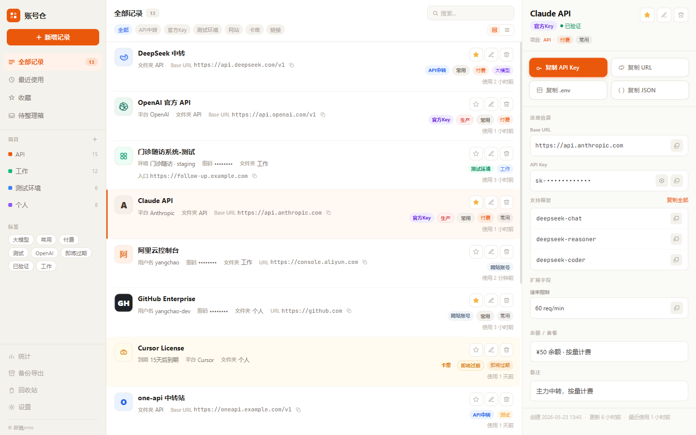
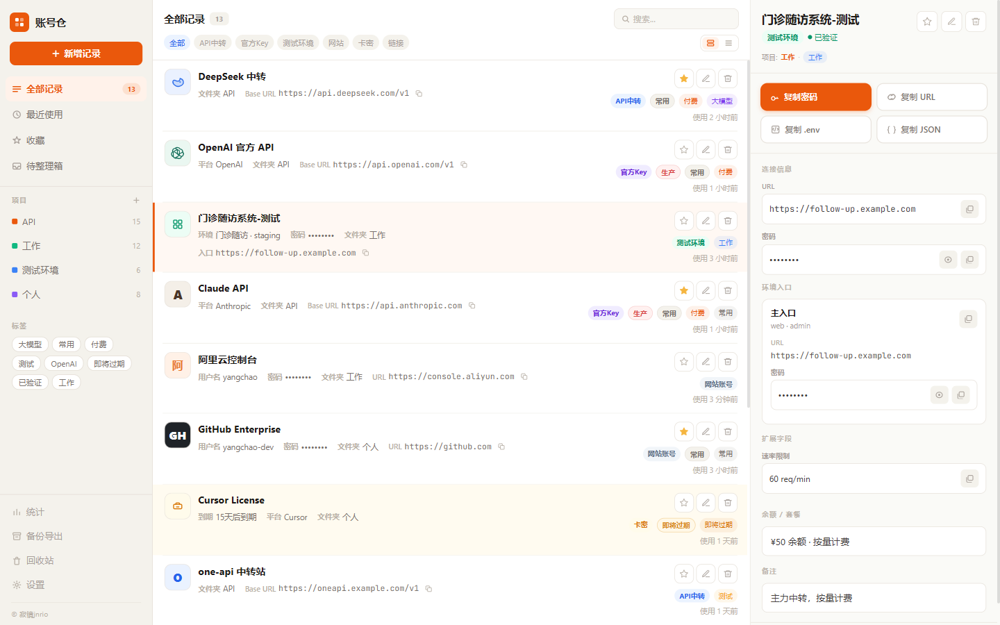

<div align="center">


# 账号仓 · Account Vault

**把散落各处的账号与密钥，收进一个安静、有序、随手可用的桌面应用。**

安全 · 有序 · 随手可用

[](#-安装)
[](#-安装)
[](#-安装)
[](https://tauri.app)
[](https://react.dev)
[](https://www.typescriptlang.org)
[](https://www.rust-lang.org)
[](#-安装)

</div>

---

> **一句话：** 本地优先、敏感字段加密、零云端依赖。给开发者与重度账号使用者一个"自己的账号仓房"——不开会员、不传服务器、不被广告打扰。

## 🌿 为什么是「账号仓」

我们都经历过——

API Key 躺在微信文件里、测试环境账号记在备忘录、卡密存在浏览器密码管理器、客户的临时账号复制在剪贴板里随时过期……

**账号仓**把这些统统收拢到一个本地桌面应用里：一个窗口、左侧分类、右侧详情、一键复制、全文搜索。

- 🔒 **数据完全在本地**——SQLite 落盘，敏感字段加密存储，不连任何云端。
- 🎯 **为「复制即用」而生**——API Key、密码、URL、.env、JSON、模型列表，点一下就进剪贴板；复制后可自动清空剪贴板。
- 🗂 **真的有序**——文件夹（支持嵌套）、标签分组、收藏、最近使用、待整理箱，加上 ⌘K 全局搜索。
- 🧩 **为开发者定制**——区分 API 中转 / 官方 Key / 测试环境 / 网站账号 / 卡密 / 常用链接 六类，自动识别、分组管理。
- 🎨 **克制的编辑式界面**——暖白底、深海军蓝、线性图标、无打扰。好看，但不喧宾夺主。

---

## ✨ 核心功能

| 能力 | 说明 |
| --- | --- |
| 🗂 **多类型记录** | API 中转站、官方 Key、测试环境、网站账号、卡密授权、常用链接，各有专属字段 |
| 🔐 **本地加密** | 敏感字段（密码 / API Key / 卡密）加密落盘，主密码与应用锁可选 |
| ⚡ **一键复制** | 单字段复制、.env 片段、JSON 配置、模型清单、入口 URL；复制后可自动清除剪贴板 |
| 🔍 **全局搜索** | `Ctrl/⌘ + K` 唤起，支持自然语言命令解析（如"找生产环境的 Claude"） |
| 📁 **文件夹与标签** | 嵌套文件夹 + 六组标签（平台 / 状态 / 用途 / 风险 / 项目 / 自定义） |
| ⭐ **收藏与最近** | 常用记录一键置顶，按使用频率自动排序 |
| 📥 **待整理箱** | 从微信 / 文档粘一段杂乱文本，先收着，回头再慢慢归档成结构化记录 |
| 💾 **备份与恢复** | 一键生成加密备份到本地任意路径，支持从本地文件恢复 |
| 📤 **数据导出** | 导出 Excel / CSV，可选是否包含敏感字段 |
| 🗑 **回收站** | 软删除 + 可恢复 + 彻底删除，误操作不慌 |
| 📊 **统计看板** | 类型分布、即将过期、高风险、待整理，一眼掌握全局 |
| 🩺 **健康检查** | 检测弱密码、过期、重复使用等隐患 |
| 🎨 **主从双栏** | 左列表、右详情，选中即看，效率拉满 |

---

## 🖼 界面一览

> 截图即将补充。把图片放入 `docs/` 目录后，取消下方注释即可显示。

<!--

<div align="center">

<p><em>主界面：左列表 + 右详情的主从双栏布局</em></p>

<p><em>详情视图：一键复制、敏感字段、环境入口、模型清单</em></p>
</div>

-->

---

## 🛠 技术栈

| 层 | 技术 |
| --- | --- |
| 桌面框架 | **Tauri 1.5**（Rust 后端 + 系统 WebView，体积小、内存低） |
| 前端 | **React 18** · **TypeScript 5** · **Vite 5** |
| 样式 | **Tailwind CSS 3**（自定义「编辑部」暖色设计令牌） |
| 状态 | **Zustand** · **React Router 6** |
| 存储 | **SQLite (rusqlite)**，敏感字段 AES 加密 |
| 导出 | **rust-xlsxwriter**（Excel）· **csv**（CSV） |

---

## 📦 安装

### 方式一：下载安装包（推荐）

前往 [Releases 发布页](https://github.com/jnrio-yc/ZhangHaoBa/releases) 下载对应平台的安装包：

- **Windows**：`账号仓_1.0.0_x64-setup.exe`（NSIS 安装器）
- **macOS**：`账号仓_1.0.0_x64.dmg`（Intel）或 arm64 版本
- **Linux**：AppImage / deb

> Windows 11 自带 WebView2 运行时；Windows 10 首次启动会自动引导安装。

### 方式二：从源码构建

**前置依赖**

- [Node.js](https://nodejs.org/) ≥ 18
- [Rust](https://www.rust-lang.org/tools/install)（stable 工具链）
- Windows：[Visual Studio Build Tools](https://visualstudio.microsoft.com/visual-cpp-build-tools/)（C++ 桌面开发工作负载）
- macOS：Xcode Command Line Tools（`xcode-select --install`）
- Linux：`webkit2gtk-4.0`、`libssl` 等系统依赖（见 [Tauri 预先要求](https://tauri.app/v1/guides/getting-started/prerequisites)）

**构建运行**

```bash
git clone https://github.com/jnrio-yc/ZhangHaoBa.git
cd ZhangHaoBa
npm install

# 开发模式（热重载）
npm run tauri dev

# 打包发布版（产物在 src-tauri/target/release/bundle/）
npm run tauri build
```

---

## 🔐 数据与隐私

- **完全离线**：应用启动后不发起任何网络请求，不存在云端账号、不上报任何遥测。
- **本地存储**：数据保存在系统应用数据目录（如 Windows 的 `%APPDATA%\com.accountvault.app\`）。
- **敏感字段加密**：密码、API Key、卡密在写入数据库前加密，界面默认以掩码显示。
- **剪贴板保护**：可开启"复制后自动清除剪贴板"，避免敏感信息残留。
- **备份文件即数据库副本**：备份生成的是独立文件，可拷贝到任意位置离线保管；恢复时从本地文件读取。

---

## 🚀 路线图

- [x] 六大记录类型与主从双栏界面
- [x] 全局搜索（⌘K）+ 命令解析
- [x] 本地备份 / 恢复 / 导出
- [x] 主密码、应用锁、剪贴板自动清除
- [ ] 移动端只读 companion（查看 / 复制）
- [ ] 跨设备同步（端到端加密，可选自托管中继）
- [ ] 浏览器扩展：一键网页账号入库
- [ ] 团队共享保险箱（加密群组）

---

## 🤝 贡献

欢迎提 Issue 反馈 bug、提功能建议，或直接发 Pull Request。

```bash
# 推荐的开发流程
git checkout -b feat/your-feature
npm run tauri dev      # 调试
npm run build          # tsc 类型检查 + vite 生产构建
```

---

## 📄 License

本项目源代码暂以 **MIT** 协议开源，详见 [LICENSE](LICENSE)。`LICENSE` 文件可自行补充。

<div align="center">

**安全 · 有序 · 随手可用**

© 2026 账号仓 · 由 [寂镜jnrio](https://github.com/jnrio-yc) 打造

⭐ 如果这个项目对你有帮助，欢迎给个 Star

</div>
