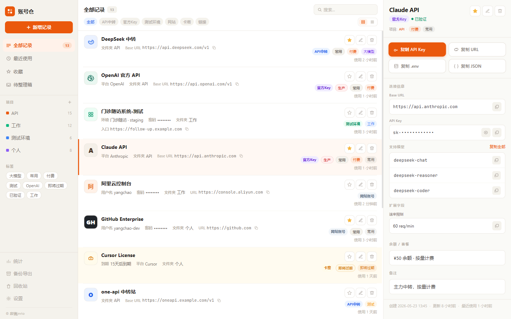
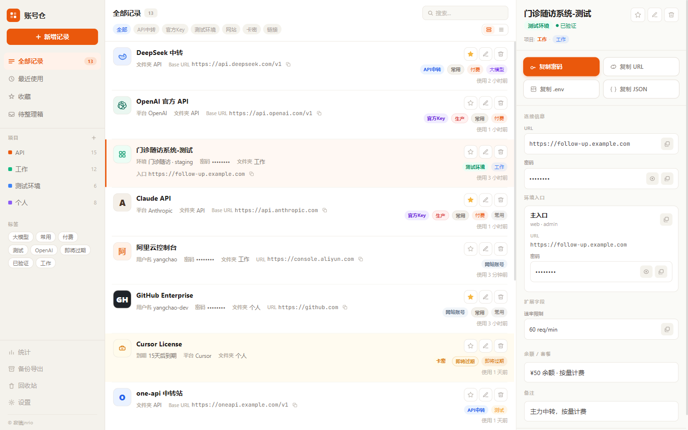

# 账号仓 Account Vault

账号仓是一款用于管理账号、API Key、卡密、测试环境、常用链接的本地桌面效率工具。

它的目标很简单：把散落在微信、文档、浏览器收藏夹、备忘录里的重要账号资料，收进一个安静、有序、可长期使用的本地资料库。





## 核心特性

- 本地优先：数据保存在本机 SQLite 数据库中，不随安装包分发。
- 敏感字段保护：密码、API Key、卡密默认脱敏显示，按需复制。
- 多类型记录：支持 API 中转、官方 API、测试环境、网站账号、卡密、常用链接。
- 主从布局：左侧记录列表，右侧明细面板，点击记录即可查看复制入口和字段详情。
- 快捷复制：支持复制 URL、API Key、`.env`、JSON、模型列表等常用内容。
- 文件夹与标签：支持文件夹分类、类型标签、自定义标签、收藏、最近使用。
- 待整理箱：可先保存临时账号内容，之后再整理成结构化记录。
- 备份导出：支持本地备份、恢复、Excel/CSV 导出。
- 桌面体验：基于 Tauri + React，体积小，启动快。

## 下载安装

前往 [GitHub Releases](https://github.com/jnrio-yc/ZhangHaoBa/releases) 下载最新版。

### Windows

下载：

```text
账号仓_1.0.1_x64-setup.exe
```

运行安装即可。重新安装新版程序不会覆盖之前保存的账号记录。

### macOS

下载与你电脑芯片匹配的 DMG：

```text
账号仓_1.0.1_aarch64.dmg   # Apple Silicon
账号仓_1.0.1_x64.dmg       # Intel
```

如果 macOS 提示“已损坏”或“无法验证开发者”，这是因为当前构建未做 Apple 官方签名与公证。可以在终端中对下载的 App 执行：

```bash
xattr -dr com.apple.quarantine /Applications/账号仓.app
```

后续如果接入 Apple Developer 证书和 notarization，就可以消除这个提示。

## 数据保存位置

账号仓不会把用户记录打进安装包。程序数据保存在系统用户数据目录：

| 系统 | 数据目录 |
| --- | --- |
| Windows | `%APPDATA%\account-vault\vault.db` |
| macOS | `~/Library/Application Support/account-vault/vault.db` |
| Linux | `$XDG_DATA_HOME/account-vault/vault.db` 或 `~/.local/share/account-vault/vault.db` |

升级或重新安装应用时，安装器只更新程序文件，不会主动删除上述数据库。卸载前如果选择手动清理用户数据，请先导出或备份。

## 从源码构建

需要：

- Node.js 18+
- Rust stable
- Windows: Visual Studio Build Tools
- macOS: Xcode Command Line Tools

安装依赖：

```bash
npm install
```

开发运行：

```bash
npm run tauri dev
```

构建 Windows 安装包：

```bash
npm run tauri -- build --bundles nsis
```

构建 macOS DMG：

```bash
npm run tauri -- build --bundles dmg
```

构建产物位于：

```text
src-tauri/target/release/bundle/
```

## 技术栈

- Tauri 1.x
- React 18
- TypeScript
- Vite
- Zustand
- SQLite / rusqlite
- Tailwind CSS

## 版本

当前版本：`1.0.1`

## 开发者

寂镜jnrio
